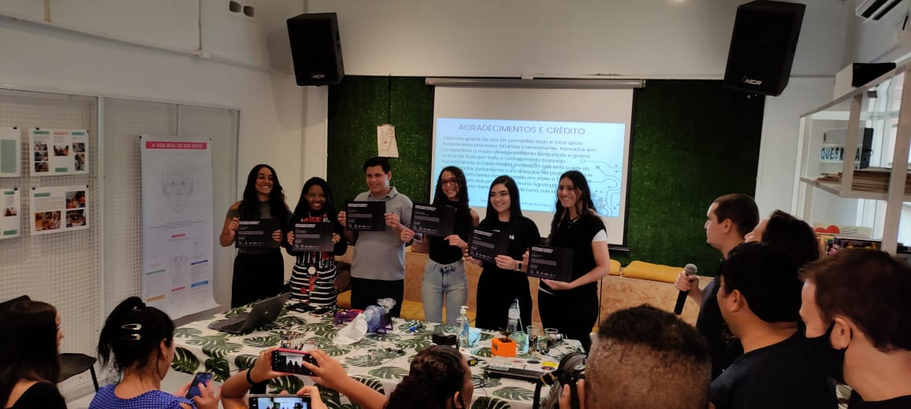
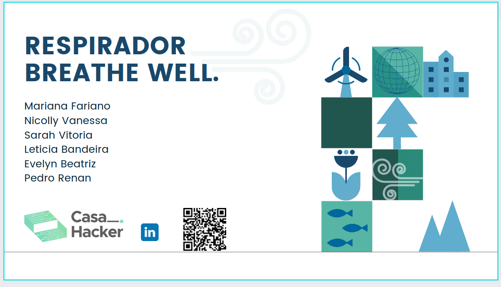

# Respirador Breathe Well

<h3 style='text-aligment= justify'> Esse projeto foi desenvolvido durante a Hackaton da [Casa Hacker](https://www.casahacker.org/) em colaboração com diversas unidades que visam o desenvolvimento intelectual e tecnológico de diversos estudantes do ensino médio. Esse foi o  projeto final do curso de Robôtica e IA, que foi desenvolvido no decorrer de 2 meses. O objetivo foi de criar um MVP (mínimo produto viável), usando impressão 3d, eletrônica, programaçãoe tecnicas de inovação, o resultado foi apresentado pelos alunos  no dia 24/04/22.
</h3>

<h3 style='text-aligment= justify'> O projeto consiste em um respirador de baixo custo, que usa um motor para acionar automáticamente o respirador manual tipo ambu, permitindo a ventilação de forma automática. Ele é apenas o começo, vamos moldando conforme nossos avanços, para que ele possa ser a semente de algo maior no futuro!
</h3>

### **Alunos**: 
* ### Mariana Fariano Gonçalves 
* ### Nicolly Vanessa 
* ### Leticia Bandeira 
* ### Sara Vitoria 
* ### Evelyn Beatriz 
* ### Pedro Renan

 

### **Orientadores**: Douglas Esteves, Fabio Souza, Bruno Agrofoglio, Rafael Estevam, Diana Santos, Matheus de Luca, Luís Henrique, Lucas Kamp.

# Confira um pouco sobre o projeto

 :arrow_down:  :arrow_down:  :arrow_down:

[Apresentação Respirador Breathe Well](https://www.canva.com/design/DAE-wdh7uSA/UKtB_Q2I7qD-B3DgXVNbmg/view?utm_content=DAE-wdh7uSA&utm_campaign=designshare&utm_medium=link2&utm_source=sharebutton)

[Projeto base para a impressão](https://github.com/otavioalfenas/RespireFundo)